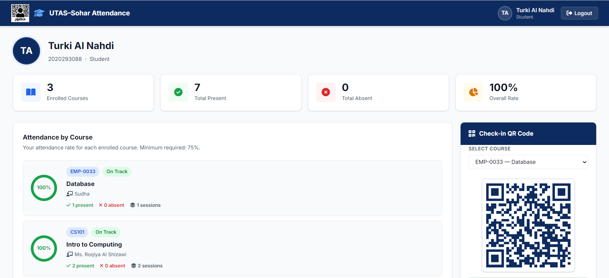
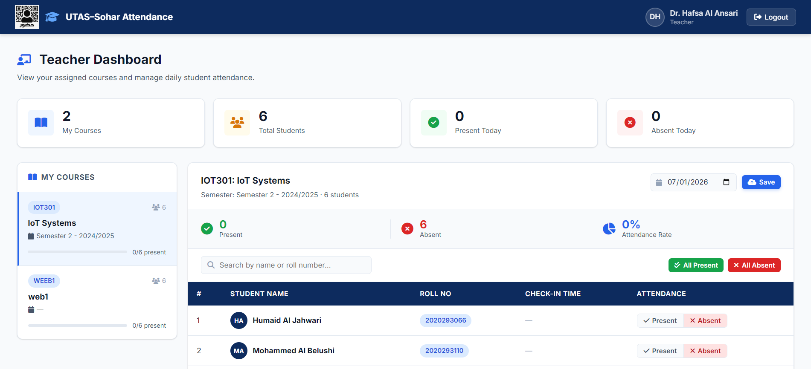
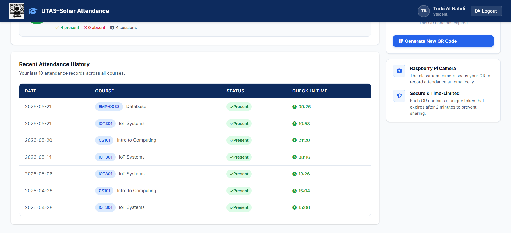

# 🎓 Smart Attendance System using QR Code & Raspberry Pi

> A smart attendance management system developed as a Graduation Project to automate student attendance using QR Code technology, Raspberry Pi, and a web-based management system.

---

## 📖 Overview

The Smart Attendance System is designed to replace traditional manual attendance methods with a secure and automated solution.

Students scan a unique QR Code, which is verified through a Raspberry Pi QR scanner and processed by a PHP backend connected to a MySQL database. The system provides separate dashboards for administrators, teachers, and students.

---

## ✨ Features

- ✅ QR Code Attendance Verification
- ✅ Raspberry Pi QR Scanner
- ✅ Student Dashboard
- ✅ Teacher Dashboard
- ✅ Admin Dashboard
- ✅ Attendance History
- ✅ Course Management
- ✅ Student Management
- ✅ Secure Login System
- ✅ MySQL Database Integration
- ✅ Responsive Web Interface

---

## 🛠 Technologies Used

| Technology | Purpose |
|------------|---------|
| PHP | Backend Development |
| MySQL | Database |
| Python | Raspberry Pi QR Scanner |
| Raspberry Pi | QR Code Scanner Device |
| HTML5 | Frontend |
| CSS3 | Styling |
| JavaScript | Client-side Functionality |
| XAMPP | Local Server Environment |

---

## 🏗 System Architecture

```text
Student
    │
    ▼
QR Code
    │
    ▼
Raspberry Pi Scanner (Python)
    │
    ▼
PHP Backend
    │
    ▼
MySQL Database
    │
    ▼
Admin / Teacher / Student Dashboard
```

---

## 📁 Project Structure

```text
smart-attendance-system-qr
│
├── assets/
├── backend/
├── css/
├── js/
├── pages/
├── scanner.py
├── index.html
├── requirements.txt
└── README.md
```

---

## 📷 Screenshots

| Login | Student Dashboard |
|--------|-------------------|
|  |  |

| Teacher Dashboard | Admin Dashboard |
|--------|-------------------|
|  |  |

| QR Scanner | Attendance History |
|--------|-------------------|
|  |  |

---

## 🚀 Installation

1. Install XAMPP.
2. Copy the project into the `htdocs` folder.
3. Import the MySQL database.
4. Start Apache and MySQL.
5. Open the project in your browser.
6. Configure Raspberry Pi scanner if required.

---

## 🔮 Future Improvements

- Face Recognition
- NFC Support
- Mobile Application
- Cloud Deployment
- Push Notifications
- Analytics Dashboard
- Multi-University Support

---

## 👨‍💻 Developer

**Turki Al Nahdi**

IT Graduate

GitHub: https://github.com/turkisaid

---

## 📄 License

This project was developed for educational purposes as a Graduation Project.